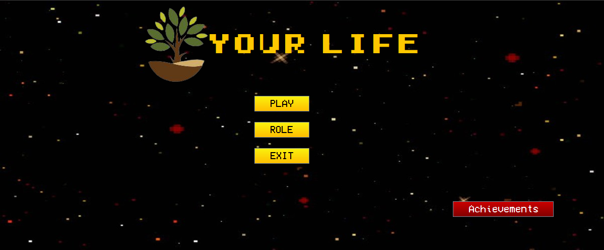
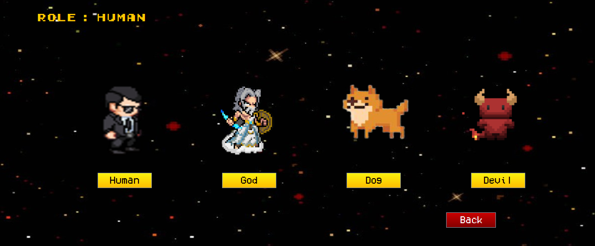
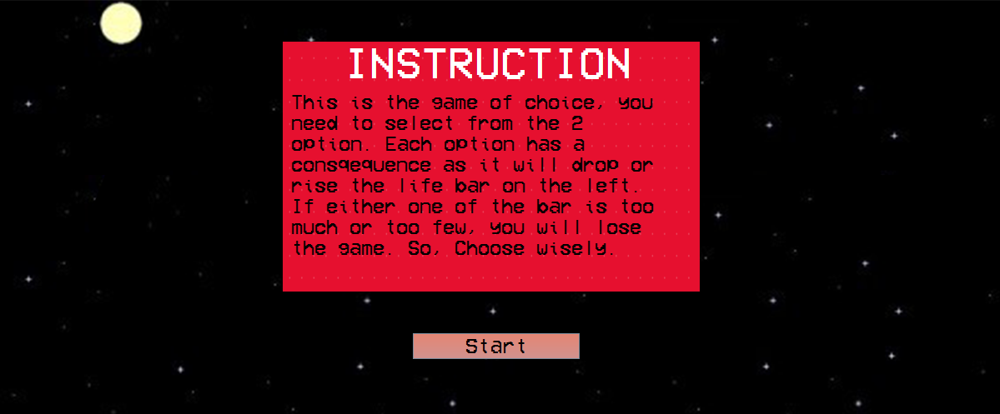
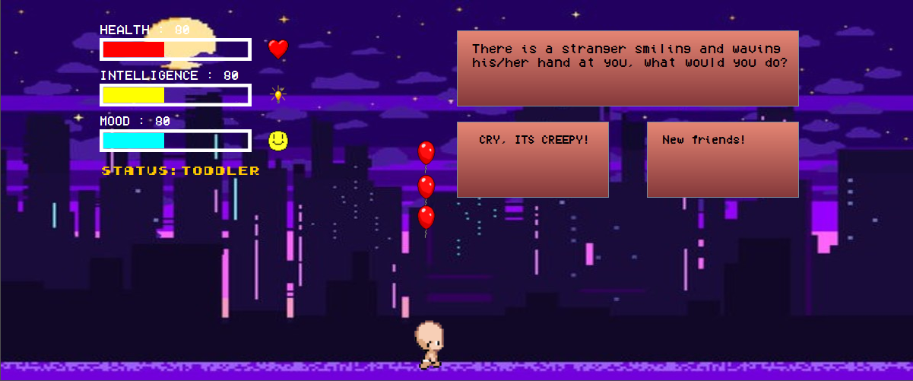
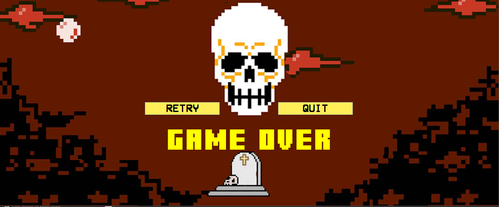
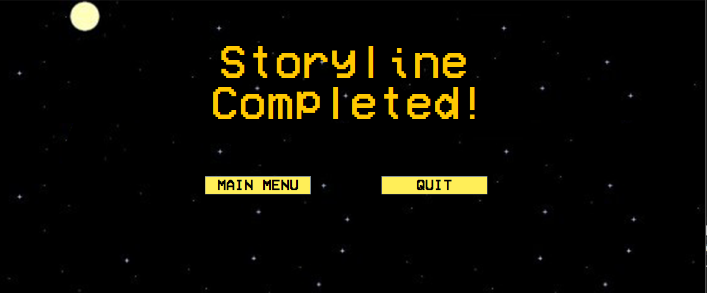

# Your Life

Sebuah choice-based game.
***
## Venomenas
### Anggota: (PBO-G)

- Frans Wijaya 05111940000098
- Vincent Yonathan 05111940000186

### Deskripsi Game

Your Life adalah sebuah choice-based game, dimana player diharuskan memilih antara dua pilihan untuk setiap pertanyaan yang ada. Setiap pilihan akan memberikan dampak yang berbeda terhadap status-status dari sebuah role.

Player dapat memilih beberapa role kehidupan yang tersedia seperti human, god, dog, dan devil. Tetapi, untuk membuka semua role tersebut, player perlu menyelesaikan terlebih dahulu role sebelumnya. Misalkan, player ingin memainkan role God, maka player harus menyelesaikan permainan sebagai human terlebih dahulu.

Adapun untuk menyelesaikan cerita dari sebuah role, player harus mampu melewati 30 kasus kehidupan dengan ketiga status yang ada tetap seimbang. Jika di antara ketiga status ini, ada satu saja yang terlalu tinggi atau terlalu rendah, maka player dinyatakan kalah.

- Tampilan Main Menu

- Tampilan Role Menu

- Tampilan Instruksi

- Tampilan In Game

- Tampilan Kalah

- Tampilan Menang

***
## Kontrol
Untuk memilih salah satu jawaban, player perlu mengspawn objek yang bisa terbang. Apabila objek tersebut mengenai salah satu box jawaban, maka artinya pemain memilih jawaban tersebut.
- Spasi : Mengspawn objek
- Right Arrow : Menggerakkan character ke kanan
- Left Arrow : Menggerakkan character ke kiri
- Mouse : Menekan tombol
***

## Authors
* **Frans Wijaya** - *Initial Work* - [franswjy403](https://github.com/franswjy403)
* **Vincent Yonathan** - *Initial Work* - [vincentyonathan](https://github.com/vincentyonathan)
***
## Project Status
On development.
